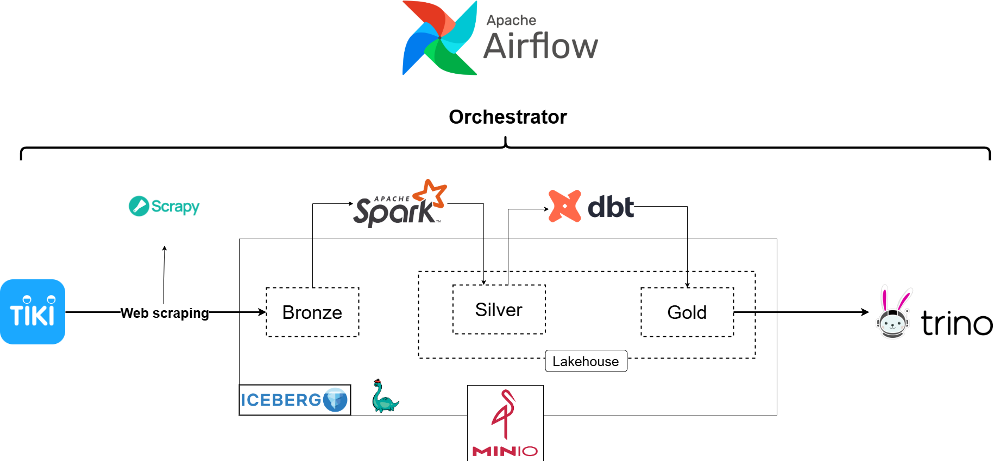
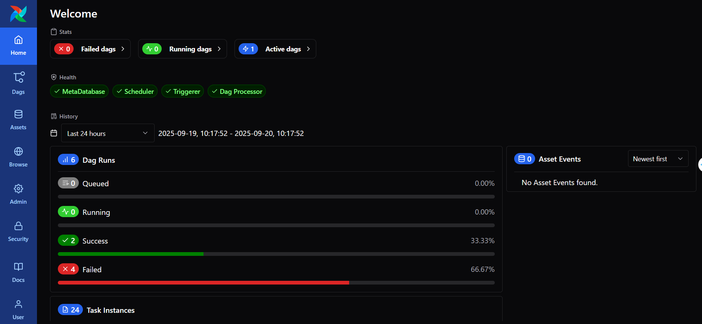
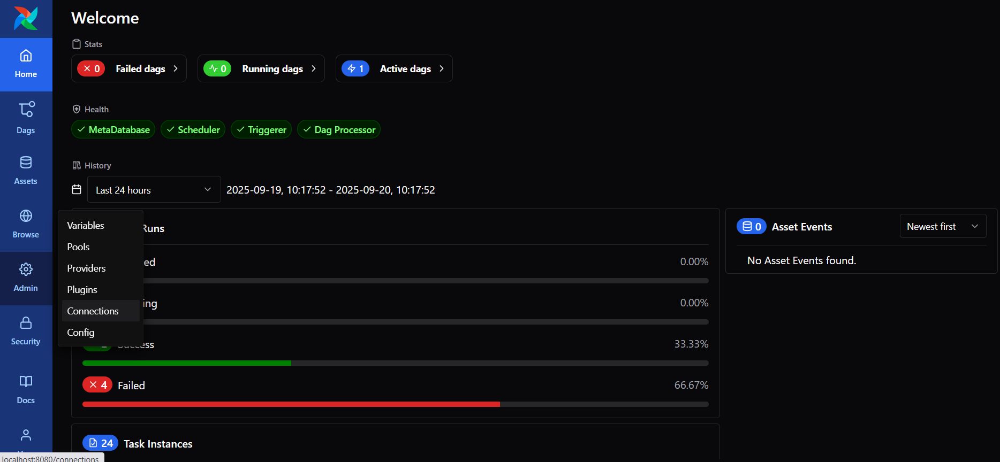
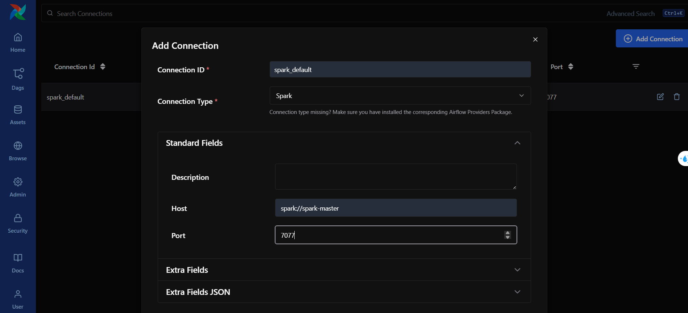
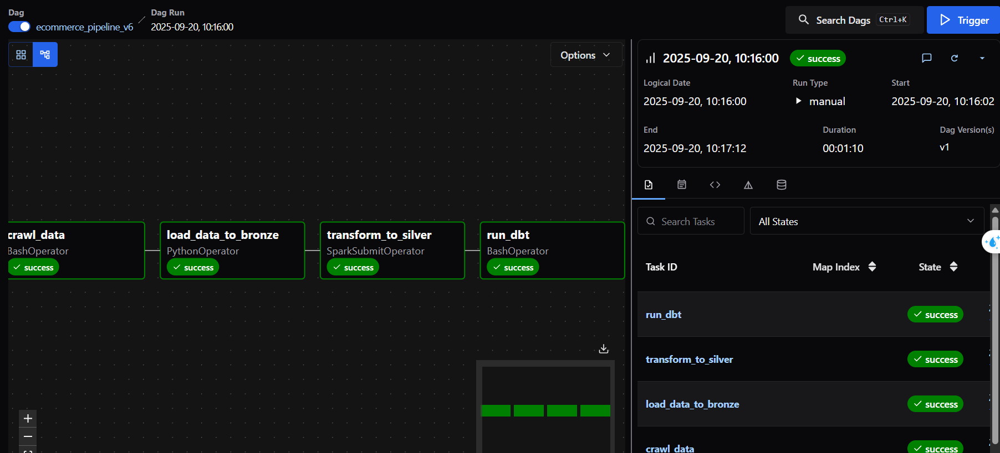
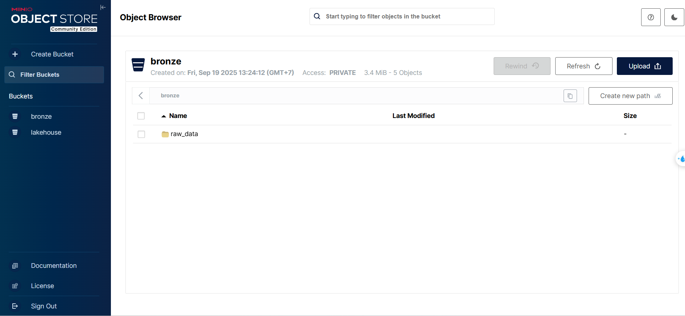
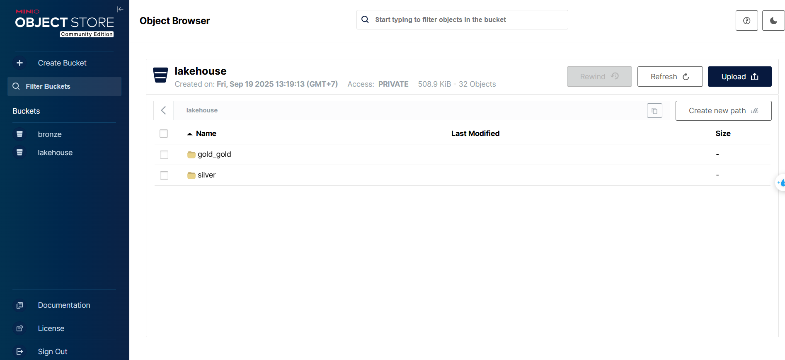
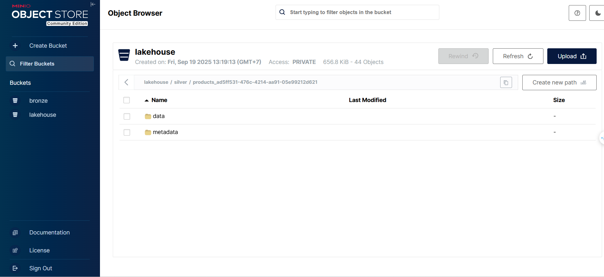
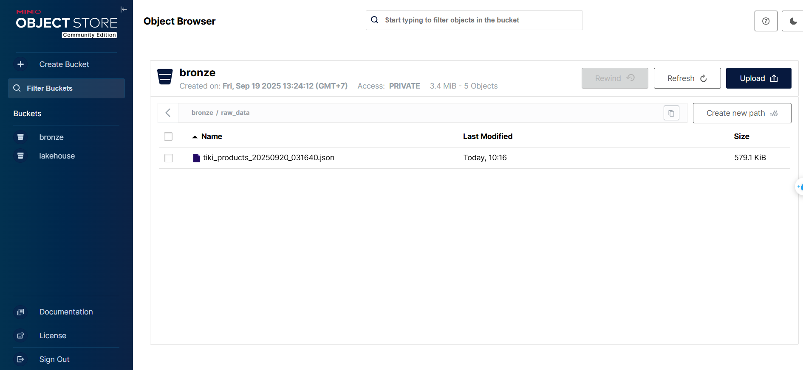

# Ecommerce Pipeline 🛒
[](https://github.com/Cngdz/Ecommerce_pineline) [](https://www.python.org/)


## Description 🚀
This project implements an e-commerce data pipeline using Airflow, Spark, MinIO, Trino, and dbt to crawl product data from Tiki, transform it, and load it into a modern data lakehouse (MinIO + Iceberg + Nessie).
The pipeline consists of several stages:
- Crawling data with Scrapy.
- Uploading raw data to MinIO (Bronze layer).
- Transforming data using Spark (Silver layer).
- Data modeling and analytics with dbt + Trino (Gold layer).


## Table of Contents 🧭
- [Ecommerce Pipeline 🛒](#ecommerce-pipeline-)
  - [Description 🚀](#description-)
  - [Table of Contents 🧭](#table-of-contents-)
  - [Features ✨](#features-)
  - [Tech Stack 🛠️](#tech-stack-️)
  - [Project Structure](#project-structure)
  - [Installation ⚙️](#installation-️)
  - [Usage 💡](#usage-)
    - [Real-World Use Case](#real-world-use-case)
  - [Contributing 🙌](#contributing-)
  - [Footer 📜](#footer-)


## Features ✨
- **Data Crawling**: Scrapes product data from Tiki using Scrapy. 🕷️
- **Data Storage**: Stores raw and processed data in MinIO (S3-compatible). 📦
- **Data Transformation**: Cleans and transforms data with Spark (PySpark). 🔄
- **Data Orchestration**: Orchestrates the entire pipeline using Apache Airflow. 💨
- **Data Modeling**: Uses dbt for data modeling and transformation in the data warehouse. 📊
- **Containerization**: Docker Compose for reproducible environments. 🐳
- **Lakehouse Architecture**: MinIO + Iceberg + Nessie + Trino for a modern data platform.


## Tech Stack 🛠️
- **Programming Language**: Python 🐍
- **Frameworks**: Apache Airflow, Apache Spark (PySpark), Scrapy, dbt
- **Data Storage**: MinIO
- **Data Lakehouse**: Iceberg, Nessie
- **Containerization**: Iceberg + Nessie + Trino
- **Configuration**: YAML


## Project Structure 




## Installation ⚙️
1. **Clone the repository:**
   ```bash
   git clone https://github.com/Cngdz/Ecommerce_pineline.git
   cd Ecommerce_pineline
   ```

2. **Set up environment variables:**
   Ensure that the following environment variables are set. Create the `.env` file:

   ```bash
   AIRFLOW_UID=50000
   _PIP_ADDITIONAL_REQUIREMENTS="dbt-core dbt-postgres"
   ```
3. **Install dependencies:**
   - Download https://dlcdn.apache.org/spark/spark-3.5.6/spark-3.5.6-bin-hadoop3.tgz in the same folder with Dockerfile

4. **Docker Setup**:

   - **Run your Docker Desktop**

   
   - **Command line for Build, Run, Setup and Stop the Docker containers using `gitbash`:**
     - Build
         ```bash
         ./manage.sh build
         ```
     - Run
         ```bash
         ./manage.sh start
         ```
     - Setup
         ```bash
         ./manage.sh setup
         ```
     - Stop
         ```bash
         ./manage.sh stop
         ```


## Usage 💡
1. **Run the Airflow DAG:**
   - Access the `Airflow UI` using `http://localhost:8080/` with the *username: **airflow***, *password: **airflow***
     
   - Connect the airflow to spark-master by click in the UI : **Admin -> Connection -> Add Connection** :
     - `Connection ID:` **spark_default**
     - `Connection Type:` **Spark**
     - `Host:` **spark://spark-master**
     - `Port:` **7077**
       
       
   - Click **Dags -> Trigger** to run the pineline
     
2. **Access MinIO:**
   - Access the `MinIO UI` using `http://localhost:9001/` with the *username: **minio_admin***, *password: **password123*** to view the stored data
     
     
     
     


### Real-World Use Case
This project demonstrates an end-to-end e-commerce data pipeline, useful for businesses that want to collect, transform, and analyze product data. It automates data collection from online stores, stores the data in a data lake, transforms the data into a structured format, and loads the data into a data warehouse for reporting and analysis. Data scientists and analysts can leverage this pipeline to gain insights into product performance, sales trends, and customer behavior.


## Contributing 🙌
1. Fork the repository.
2. Create a new branch for your feature or bug fix.
3. Make your changes and commit them.
4. Submit a pull request.


## Footer 📜
Ecommerce_pineline - [https://github.com/Cngdz/Ecommerce_pineline](https://github.com/Cngdz/Ecommerce_pineline)

Author: [Cngdz](https://github.com/Cngdz)

Contact: hd.vucuong@gmail.com

⭐ Like the project? Give it a star! ⭐
